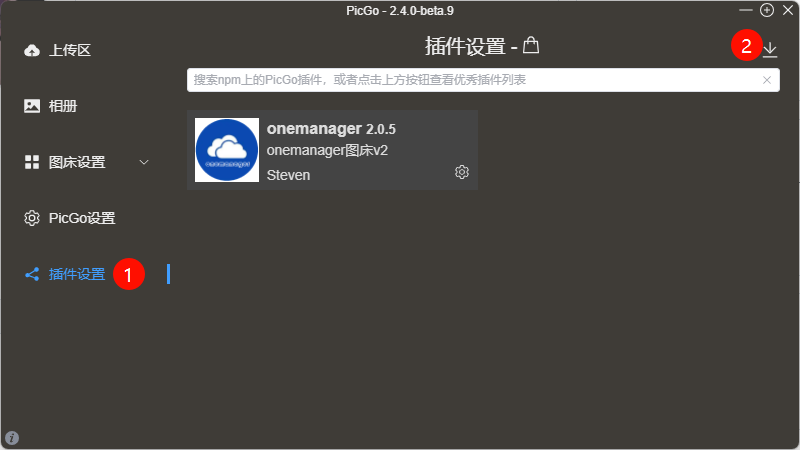
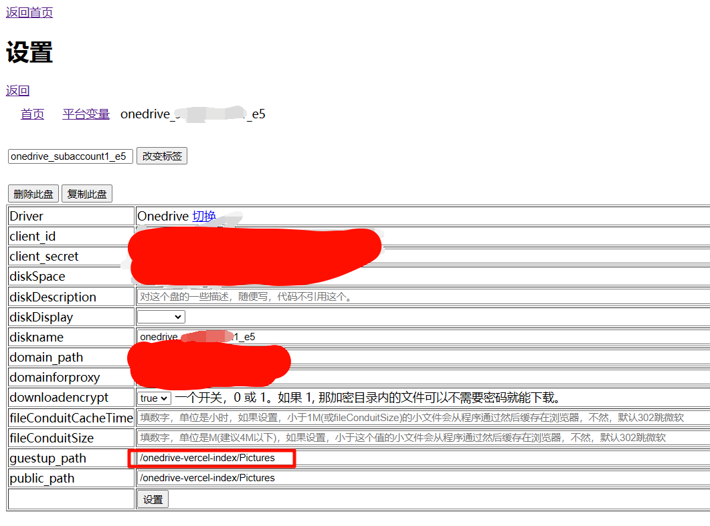
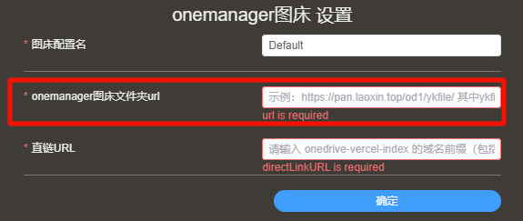
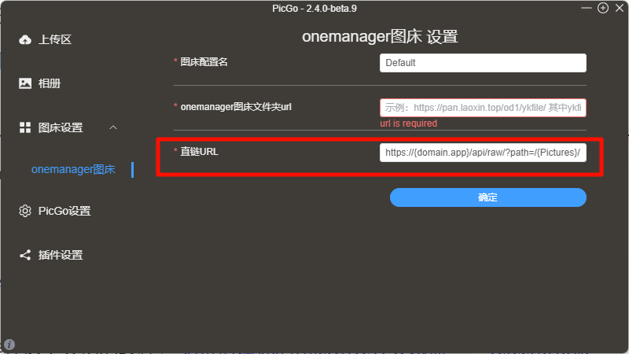

# picgo-plugin-onemanager-v2

>  A plugin for [PicGo](https://github.com/Molunerfinn/PicGo) to use OneDrive as imgur.
>
> PicGo插件，使用OneDrive作为图床。

基于[picgo-plugin-onemanager](https://github.com/laoxinH/picgo-plugin-onemanager)进行更新。解决痛点：

1. PicGo更新后[原项目上传](https://github.com/laoxinH/picgo-plugin-onemanager)报错的问题。感谢**[Orainge](https://github.com/Orainge)**在原项目提出的[Pull requests](https://github.com/laoxinH/picgo-plugin-onemanager/pull/7)解决了这个问题，我将此更新在本插件中，经测试无上传报错问题。

2. 上传图片后，基于[onedrive-vercel-index](https://github.com/spencerwooo/onedrive-vercel-index)获取图片直链（性能表现更佳）。

总而言之，本插件需提前部署两个项目：

1. [onedrive-vercel-index](https://github.com/spencerwooo/onedrive-vercel-index)，用于获取图片直链
2. [onemanager](https://github.com/qkqpttgf/OneManager-php)，用于上传图片

## 为什么制作这个插件

时至2024的尾巴，网上依旧没有简易、可用的OneDrive图床方案。

非常感谢[picgo-plugin-onemanager](https://github.com/laoxinH/picgo-plugin-onemanager)让我得以在一晚上完成本插件的开发。

[picgo-plugin-onemanager](https://github.com/laoxinH/picgo-plugin-onemanager)目前似乎只能在旧版本PicGo（2.3.1）工作，而旧版本PicGo似乎插件商店无法搜索到插件了，因此使我有了对原项目进行魔改的动机。

由于我之前已完成[onedrive-vercel-index](https://github.com/spencerwooo/onedrive-vercel-index)的搭建，因此我本来有获取图片直链的方案，但缺乏上传图片的手段，因此借用[onemanager](https://github.com/qkqpttgf/OneManager-php)项目，用于上传图片。

目前最基本的图床功能已实现：上传图片&返回直链URL，支持onedrive-vercel-index加密

喜欢的话点个Star吧，任何问题欢迎提Issue！

## 简单的教程

### 插件安装

##### ① 本地安装

下载本项目，

打开PicGo->插件设置->导入本地插件->选择本项目所在文件夹

##### ② picgo在线安装（插件设置）

~~在picgo中搜索关键词onemanagerv2即可~~（PR已经发布了，等待更新）

### onemanager设置（沿用[picgo-plugin-onemanager](https://github.com/laoxinH/picgo-plugin-onemanager)）

- 准备好一个**[onemanager](https://github.com/qkqpttgf/OneManager-php)** 
- **[onemanager](https://github.com/qkqpttgf/OneManager-php)** 搭建教程请自行搜索
- 进入你的**[onemanager](https://github.com/qkqpttgf/OneManager-php)**后台管理界面

> 我这里设置的是`/onedrive-vercel-index/Pictures`文件夹

- 打开你刚刚设置的图床文件夹
- 复制浏览器地址栏url

> 我这里是`https://pan.laoxin.top/od1/onedrive-vercel-index/Pictures`后面需要将这个url填入到插件url栏 
> 注意 ykfile 文件夹需要提前创建 
> 如果你只是挂载了一个网盘,那么`https://pan.laoxin.top/od1/onedrive-vercel-index/Pictures`这行地址中不会存在`od1`

- 打开插件设置
- 将刚刚复制的url填入即可

### onedrive-vercel-index设置

强烈推荐这个大佬的教程：[免费搭建你的OneDrive公共网盘——Vercel特供版](https://www.iamdt.cn/archives/22)

配置好以后，找到图床里面任意一个图片，获取它的下载链接，格式为（大括号内的内容可变）：

https://{domain.app}/api/raw/?path=/{Pictures}/{Picture_name}

聪明的你发现不同图片的直链URL只有{Picture_name}不同，所以这时候你就把前缀大胆放到插件设置中吧：

放进去的域名为（根据你的实际情况，修改大括号里面的内容）：

https://{domain.app}/api/raw/?path=/{Pictures}/

## 安全性分析

onemanager只用于上传，网址是放在本地PicGo的，所以我认为应该不会有安全隐患。

而暴露在互联网上的是onedrive-vercel-index的域名，因此安全性取决于onedrive-vercel-index。

onedrive-vercel-index提供了加密选项配置：

https://ovi.swo.moe/zh/docs/features/protected-folders

加密后在onedrive-vercel-index上复制图片链接，可以看到有个后缀odpt=XXXXXX

把后缀填到插件设置安全栏即可实现分享。

